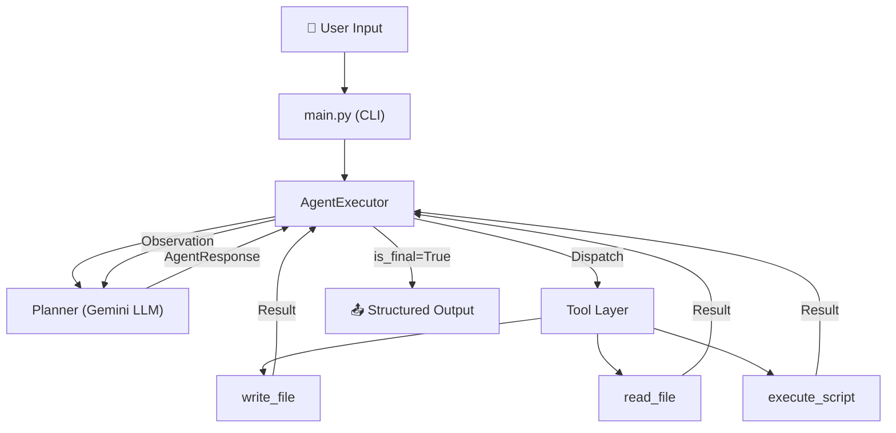

# AutoScript Agent — Full Build Implementation Plan

Build the entire AutoScript Agent project from scratch: an AI-powered Python agent that accepts natural language instructions, uses Google Gemini to reason + generate Python code, executes scripts safely, and returns structured results.

## User Review Required

> [!IMPORTANT]
> **API Key**: The agent requires a `GOOGLE_API_KEY` environment variable. You'll need to set this via a `.env` file or export it in your shell before running. Is that acceptable, or do you want a different auth mechanism?

> [!IMPORTANT]
> **Model**: The plan uses `gemini-2.0-flash` as the default model. Would you prefer a different Gemini model?

> [!WARNING]
> **Execution Safety**: Scripts will be executed via `subprocess` with a configurable timeout (default 30s). There is no Docker sandbox in this initial version. Scripts run with the same permissions as the user.

---

## Proposed Changes

### Pydantic Models — `agent/validator.py`

#### [NEW] [validator.py](file:///home/codecraft/Projects/AutoScript_Agent/agent/validator.py)

Define all structured data models used across the agent:

| Model | Purpose |
|---|---|
| `ThoughtProcess` | LLM's internal reasoning (observation, plan, self_correction) |
| `ToolCall` | A tool invocation (name + arguments dict) |
| `AgentResponse` | Full LLM response: thought + tool_call + is_final flag |
| `ExecutionResult` | Script run result: stdout, stderr, exit_code |
| `AgentFinalOutput` | Final structured output: status, output, error, exit_code |

---

### Tool Layer — `agent/tools.py`

#### [NEW] [tools.py](file:///home/codecraft/Projects/AutoScript_Agent/agent/tools.py)

Three tools matching the README spec:

| Tool | Signature | Description |
|---|---|---|
| `write_file` | `(filename: str, content: str) → str` | Creates/overwrites a file in `scripts/` dir. Returns confirmation message. |
| `read_file` | `(filename: str) → str` | Reads and returns file contents. |
| `execute_script` | `(filename: str, timeout: int=30) → ExecutionResult` | Runs a Python script via `subprocess.run()`, captures stdout/stderr/exit_code. |

Key safety measures:
- All file operations confined to `scripts/` directory by default
- Script execution has configurable timeout
- Captures all output streams

---

### LLM Planner — `agent/planner.py`

#### [NEW] [planner.py](file:///home/codecraft/Projects/AutoScript_Agent/agent/planner.py)

Handles all Gemini API interaction:

- Initializes `google.genai.Client()` with API key from environment
- Maintains a **conversation history** (list of messages) for multi-turn context
- Sends user request + system prompt → Gemini with structured output (`response_schema=AgentResponse`)
- Includes tool results as observation feedback for the next iteration
- Returns validated `AgentResponse` from `response.parsed`

System prompt will instruct the LLM to:
1. Analyze the user's request
2. Create a step-by-step plan
3. Issue one tool call at a time
4. Set `is_final=True` when the task is complete

---

### Agent Executor Loop — `agent/executor.py`

#### [NEW] [executor.py](file:///home/codecraft/Projects/AutoScript_Agent/agent/executor.py)

The orchestration engine — implements the **Reason → Plan → Act → Observe** loop:

```
while not is_final and iteration < max_iterations:
    1. Call planner.get_next_action(user_request, history)
    2. Extract tool_call from AgentResponse
    3. Dispatch to the appropriate tool (write_file / read_file / execute_script)
    4. Capture tool result
    5. Append result to history as observation
    6. Check is_final flag
    7. If is_final → return final output
```

- Max iterations: configurable (default 10)
- Error recovery: if a tool call fails, feed the error back to the LLM for self-correction
- Pretty-prints each step with colored output (thought, tool call, result)

---

### Package Init — `agent/__init__.py`

#### [NEW] [\_\_init\_\_.py](file:///home/codecraft/Projects/AutoScript_Agent/agent/__init__.py)

Exports key classes: `AgentExecutor`, `Planner`, `ToolDispatcher`

---

### CLI Entry Point — `main.py`

#### [NEW] [main.py](file:///home/codecraft/Projects/AutoScript_Agent/main.py)

- Loads `.env` via `python-dotenv`
- Validates `GOOGLE_API_KEY` is set
- Provides two modes:
  - **Interactive REPL**: Continuous prompt loop (`>>> `) for multi-task sessions
  - **One-shot**: `python main.py "your task here"`
- Displays a startup banner
- Pretty-prints final structured output as JSON

---

### Dependencies — `requirements.txt`

#### [NEW] [requirements.txt](file:///home/codecraft/Projects/AutoScript_Agent/requirements.txt)

```
google-genai>=1.0.0
pydantic>=2.0.0
python-dotenv>=1.0.0
```

---

### Environment Config

#### [NEW] [.env.example](file:///home/codecraft/Projects/AutoScript_Agent/.env.example)

```
GOOGLE_API_KEY=your_api_key_here
```

---

### Example Script

#### [NEW] [example.py](file:///home/codecraft/Projects/AutoScript_Agent/scripts/example.py)

A simple example script to demonstrate the agent's output structure.

---

## Architecture Diagram



---

## Verification Plan

### Automated Tests
1. `pip install -r requirements.txt` — verify all dependencies install cleanly
2. `python -c "from agent.validator import AgentResponse; print('OK')"` — verify Pydantic models load
3. `python -c "from agent.tools import write_file, read_file, execute_script; print('OK')"` — verify tools import
4. `python -c "from agent.executor import AgentExecutor; print('OK')"` — verify executor imports
5. Run the agent with a simple task (if API key is available): `python main.py "Create a script that prints hello world"`

### Manual Verification
- User tests the interactive REPL with various natural language prompts
- User verifies generated scripts appear in `scripts/` directory
- User confirms structured JSON output matches the expected schema
